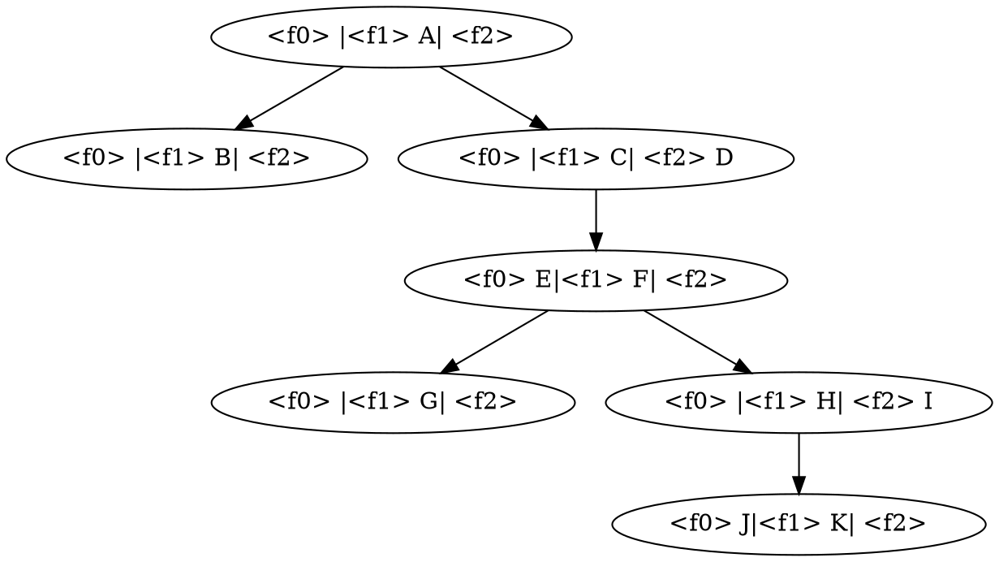
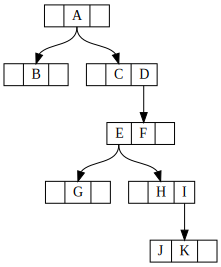
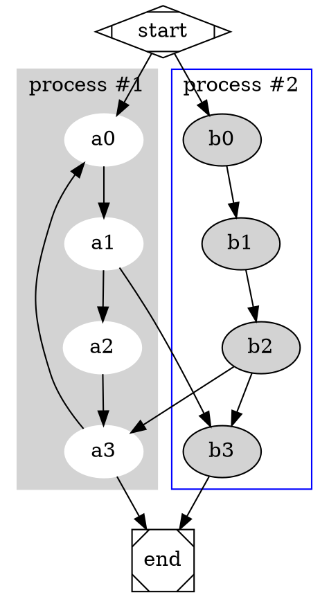
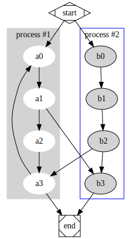
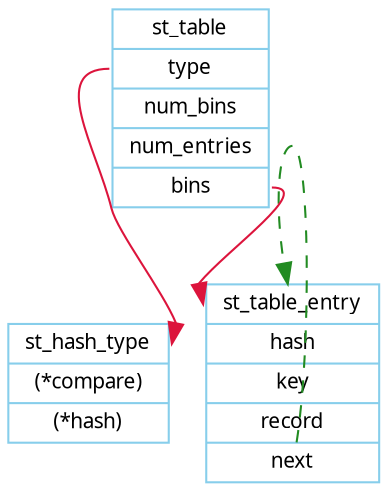
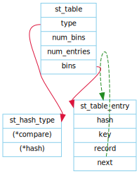
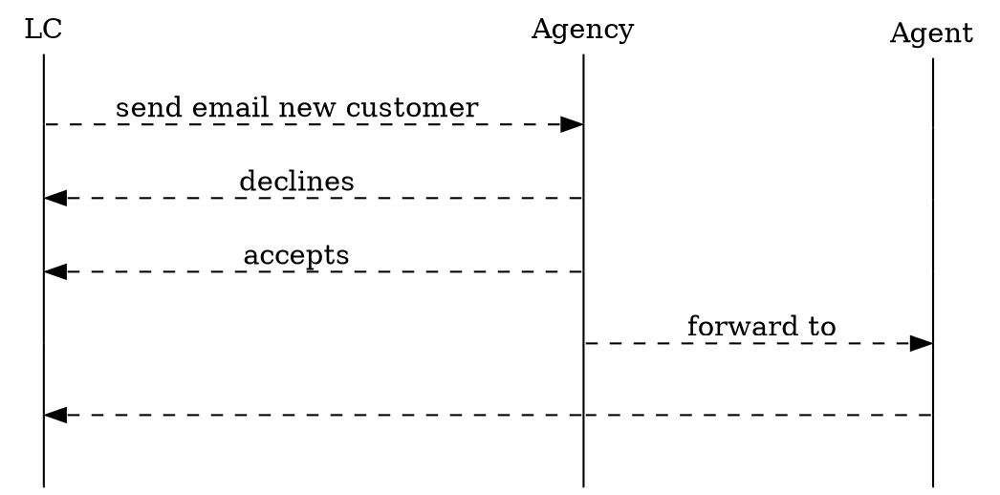
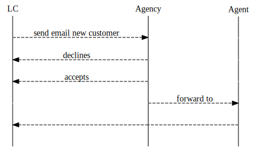

# drawing graph with dot

> dot是纯文本图像描述语言,可以使用代码描述复杂逻辑关系、组织架构、模块组成和数据结构，
> 能够实现最小复杂关系连线布局，但是无法实现自定义固定布局

* [dot语言基本知识](#dot基本知识)
* [dot基本语法demo](#dot基本语法demo)
* [graphviz命令](#命令行)

### dot基本知识
##### 语法
1. 英文字母[a-zA-Z\200-\377]，下划线_，数字[0-9]（但不能数字开头），如：Version_3；
2. 纯数字[-]?(.[0-9]+|[0-9]+(.[0-9]*)?)，如：-.1或1.414；
3. 双引号包裹的字符串"..."，字符串中的双引号需要转义\"，如："DOT language"；
4. 尖括号包裹的HTML字符串<...>，如：<<b>Welcome</b> <u>to</u> <i>China.</i>>；实际上甚至可以插入表格。HTML-Like Labels

##### 要点
* 注释：`// 注释内容` dot使用双斜杠注释
* 用 `digraph`定义有向图
* 用`->` 来表示节点之间的方向关系
* 使用 `graph`来定义无向图
* 用`--`来表示节点之间的链接关系
* 支持定义节点的属性：`a[shape=box, label="hello", style=filed, fillcolor="#ABABAB" ]` shape 形状，label 显示文字，style 填充样式，fillcolor 填充颜色
* 支持定义属性节点，可以描述不同节点之间属性关系 `label="<f0> label1 | <f1>" ` 其中fo和f1相当于属性变量名，`node0:f0 -> node1:f0` 即node0的属性f0区域指向node1的f0区域
* 可以在label属性中使用html `label=<<table><tr><td port=“id”></td></tr></table>>`
* 支持定义子图，`subgraph name{ node[style=filled, color=white]; style=filled; color=blue; b0->b1->b2; label="subgraph label"; labelcolor=white}`
* 支持定义子图内部节点与其他子图内部节点之间的关系
* 支持自定义节点之间连线的样式 `a->b [color=red, style=dashed, dir=both, arrowhead=diamond, label="go", headlabel="head", taillabel="tail"]
* 连线颜色支持多颜色分段 `color="red:green;0.4:blue"`，支持同段多色 `color="red:green`
* 支持image 属性插入图片

[详细的语法介绍请参考文档](http://graphs.grevian.org/reference)

[具体的shape，color，attribute请查看用户手册](./../../assets/docs/dotguide.pdf)

### dot基本语法demo

 

### 命令行

>  dot input.dot -T png -o output.png